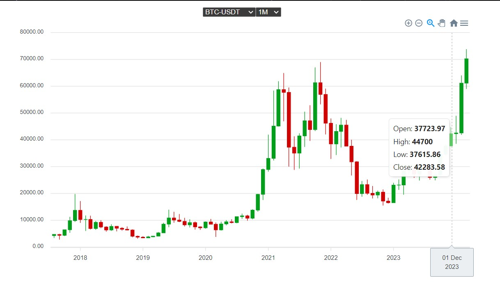

# apex-binance

## Інсталяція

Переконайтеся, що у вас встановлено Node.js. Ви можете завантажити його з [Node.js](https://nodejs.org/).

1. Клонуйте цей репозиторій:

```bash
   clone https://github.com/VasilenkoYurii/apex-binance.git
```

2. Встановіть залежності:

```bash
   npm install
```

3. Запустіть проєкт:

```bash
   npm run dev
```

## Превью


